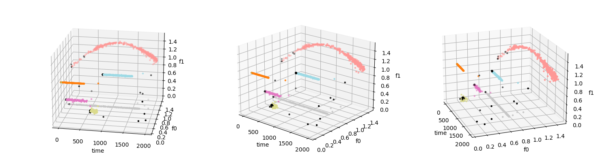

# pysdoclust-stream

**SDOclustream**: Incremental stream clustering (and outlier detection) algorithm based on Sparse Data Observers (SDO)

## Installation

SDOclustream can be installed with pip3:


        pip3 install git+https://github.com/...


However, **rebuilding** the SWIG wrappers might be necessary, mainly when adding new algorithms or modifying the interface. This requieres the installation of [SWIG](https://www.swig.org/). Hence,the complete repository should be downloaded and SDOclustream locally installed by running: 

        make && pip3 install SDOclustream.tar.xz

<br>

## Folder Structure and Evaluation Experiments

The [cpp] folder contains the code for the C++ core algorithms, which might be used directly by C++ projects. 

When using SDOclustream from Python, the C++ algorithms are wrapped by the interfaces in the SWIG folder. These wrapper functions are translated to a Python interface and have the main purpose of providing an interface which can easily be parsed by SWIG.

The [python] folder contains the Python interface invoking the Python interface provided by SWIG.

Finally, complete experiments, datasets, scripts and results conducted for the paper **Stream Clustering Robust to Concept Drift** are provided in the [evaluation_tests] folder. 

<br>

## Example

SDOclustream only requires `numpy`. It is a straighforward algorithm and very easy to configure. The main parameters are the number of observers `k`, which determines the size of the model and the parameter `T`, which defines the memory of the algorithm. 

`k` (default=300) is determined by the variability of the data and the expected number of clusters, but between [200,500] is usually appropriate for most scenarios. `T` (default=500) sets the model dynamics and inertia, so that on average it is fully replaced after processing `T` points. If the data show very fast dynamics, low `T` is recommended, while if the dynamics are slow and you want to retain old clusters for a long time, `T` should take high values.

Moreover, `input_buffer` (default=0) establishes how many points are necessary for the observers to update the internal clustering. This fundamentally affects the speed of processing. Normally most scenarios tolerate high values without significant changes. Beyond this, other parameters are inherited from SDOclust and SDOstream and do nott usually require adjustment. You'll find them described in *python/clustering.py*.

```python
from SDOclustream import clustering
import numpy as np
import pandas as pd

df = pd.read_csv('example/dataset.csv')
t = df['timestamp'].to_numpy()
x = df[['f0','f1']].to_numpy()
y = df['label'].to_numpy()

k = 200 # Model size
T = 400 # Time Horizon
ibuff = 10 # input buffer
classifier = clustering.SDOclustream(k=k, T=T, input_buffer=ibuff)
```

In the following piece of code the stream data is processed point by point. SDOclustream provides a clustering label and an outlierness score per point. Additionally, SDOclustream can perform outlier thresholding internally by giving the label *-1* to outliers. To do this, you must set ``outlier_handling=True`` and set the ``outlier_threshold`` (default=5).


```python
all_predic = []
all_scores = []

block_size = 1 # per-point processing
for i in range(0, x.shape[0], block_size):
    chunk = x[i:i + block_size, :]
    chunk_time = t[i:i + block_size]
    labels, outlier_scores = classifier.fit_predict(chunk, chunk_time)
    all_predic.append(labels)
    all_scores.append(outlier_scores)
p = np.concatenate(all_predic) # clustering labels
s = np.concatenate(all_scores) # outlierness scores

# Thresholding top outliers based on Chebyshev's inequality (88.9%)
th = np.mean(s)+3*np.std(s)
p[s>th]=-1

# Evaluation metrics
from sklearn.metrics.cluster import adjusted_rand_score
from sklearn.metrics import roc_auc_score
print("Adjusted Rand Index (clustering):", adjusted_rand_score(y,p))
print("ROC AUC score (outlier/anomaly detection):", roc_auc_score(y<0,s))
```

Giving *ARI=0.97* and *ROC-AUC=0.99*. Note how SDOclustream assigns high outlierness scores to the first points of emerging clusters.



<br>

## Aknowledgments

We would like to thank the developers of the [dSalmon](https://github.com/CN-TU/dSalmon) project for providing the framework and algorithms, in particular the MTree implementation, that were instrumental in the development of this project.
